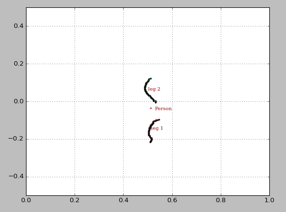

#  Leg Monitoring
## Descrição
Monitoramento das pernas utilizando a tecnologia LIDAR.  O algoritmo utiliza DBSCAN, um algoritmo de clustering baseado em densidade, para agrupar os pontos identificados pelo laser. Os conjuntos de pontos são, então, classificados como as pernas do usuário, um ponto médio entre os conjuntos é calculado e classificado como *Person*. 

O algoritmo desenvolvido publica a distância entre *Person* e o LIDAR. 

Os testes foram realizados utilizando o [RPLIDAR A3](https://www.slamtec.com/en/Lidar/A3) da *SLAMTEC*.

## Instalação
Para que o algoritmo seja executado com sucesso, é necessário instalar a scikit-learn, uma biblioteca de aprendizado de máquina em Python.
>pip install sklearn

É necessário também fazer o download do pacote [rplidar_ros](https://index.ros.org//p/rplidar_ros/#kinetic) para ROS kinetic.

## Como utilizar
O repositório é dividido em:
* **config**: diretório onde se encontra o arquivo com alguns parâmetros que podem ser modificados.
* **launch**: neste diretório estão três arquivos .launch. 
	* *leg_monitoring*: Utilizado quando o nó do rplidar já está sendo executado.
	* *rplidar_and_leg_monitoring*: Primeiro ele executa o rplidar e depois o algoritmo.
	* *rplidar_node*: Executa apenas o nó do rplidar.
* **scripts**: O script em python  responsável pelo monitoramento das pernas.

Após esse comando (ou alguma combinação dos arquivos ".launch" ja mencionados),
>roslaunch leg_monitoring rplidar_and_leg_monitoring.launch

o tópico distance, *message type float32*, é publicado e o gráfico com a identificação das pernas é plotado.

## Citação
Ao utilizar este pacote, é necessário citar o trabalho abaixo. Os repositórios [formation_control](https://github.com/ufescloudwalker/formation_control), [face_orientation](https://github.com/ufescloudwalker/face_orientation) e [leg_monitoring](https://github.com/ufescloudwalker/leg_monitoring) são baseados no artigo [A novel multimodal cognitive interaction for walker-assisted rehabilitation therapies](https://ieeexplore.ieee.org/abstract/document/8779469/).

>@inproceedings{scheidegger2019novel,
  title={A novel multimodal cognitive interaction for walker-assisted rehabilitation therapies},
  author={Scheidegger, Wandercleyson M and de Mello, Ricardo C and Jimenez, Mario F and M{\'u}nera, Marcela C and Cifuentes, Carlos A and Frizera-Neto, Anselmo and others},
  booktitle={2019 IEEE 16th International Conference on Rehabilitation Robotics (ICORR)},
  pages={905--910},
  year={2019},
  organization={IEEE}
}
